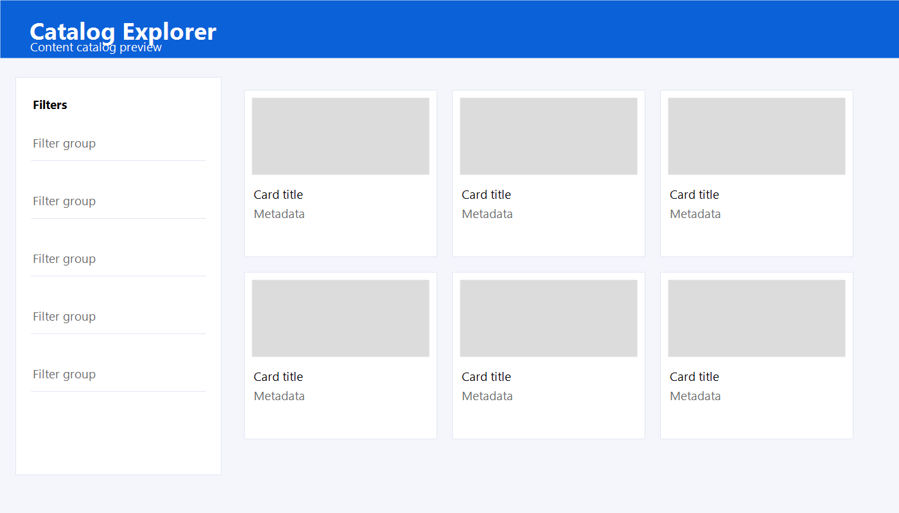
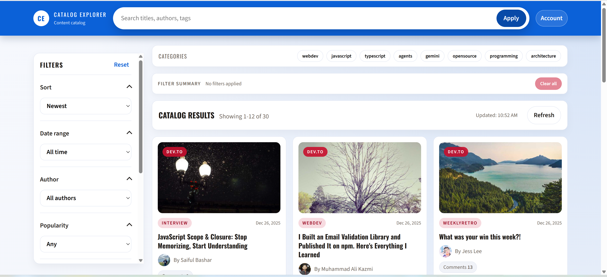

# Catalog Explorer React App

**Business-grade content catalog UI** built with **React** and **React Query** for resilient, data-driven browsing. Designed for demo and portfolio use without proprietary or sensitive production code.

> A modern catalog dashboard with search, filters, pagination, and stable data handling for real-world APIs.


*Screenshot: search, filters, category pills, and card grid.*

## Screenshots




Built by Sunday Oyebiyi.

## How to use

- Install dependencies: `npm install`
- Start the dev server: `npm start`
- Open: **http://localhost:3000**
- Optional: copy `.env.example` to `.env.local` to point at another API

## Features

- Catalog layout with sticky top bar, left filter sidebar, and category pills.
- Search + author filter, tag multi-select, date range, min comments, sorting controls, pagination UX, and filter summary with "Clear all".
- URL-driven state for shareable/bookmarkable links and back/forward navigation.
- React Query caching with retries, background refetching, and stale-while-revalidate behavior.
- Skeleton loading, empty/error states, and footer metadata for data source + last updated time.
- Schema validation + telemetry hooks with keyboard navigation and focus management.

## Tech stack

- React (function components + hooks)
- React Query for caching, background refetching, and retries
- Custom URL state helpers for deep linking
- JSON Schema (Ajv) for runtime validation
- Jest + React Testing Library for unit and UI tests

## Data source

By default the app reads from the Dev.to API for rich, real-world fields:
`https://dev.to/api/articles?per_page=30`
To plug in a private API, set `REACT_APP_ARTICLES_URL` in `.env.local` using `.env.example` as a template.
When a non-Dev.to URL is set, a "Configured API" option appears in the Data Source switcher in the UI.

## Schema & validation

The article contract lives in `src/schemas/articles.schema.json`.
Runtime validation runs after normalization; invalid items are dropped and reported via `src/utils/telemetry.js`.
To integrate monitoring, provide `window.__APP_MONITOR__.reportEvent(name, payload)` in your host app.

## Multi-type payloads

If your API returns mixed schemas, send each item as `{ "type": "...", "data": { ... } }`.
Supported types: `article`, `devto`. Unknown types are ignored and reported via telemetry.

## Hiring Manager View

- Scalable, data-driven catalog UI with complex UI state management.
- Shareable + bookmarkable URLs through URL-driven state.
- Fault-tolerant API consumption with caching, retries, and stale-while-revalidate behavior.
- Searchable, filterable, sortable lists with pagination UX.
- Resilient UX with skeleton loading, empty/error states, and refresh controls.
- Hardening against schema drift through normalization, validation, and telemetry.

## Testing

The test suite covers normalization/sorting logic and schema validation.
Key UI rendering states (loading, empty, error) are verified with React Testing Library.

Run tests with:

```bash
npm test
```

## Project structure

```text
src/
  components/  # UI layout, filters, cards, pagination, skeletons
  hooks/       # data fetching + URL state
  utils/       # normalization, sorting, telemetry, schema validation
  schemas/     # JSON schema for the normalized article contract
```

## Notes

The UI assumes each item can map to a normalized article shape.
Add your internal API URL in `.env.local` to use production-like data locally.
