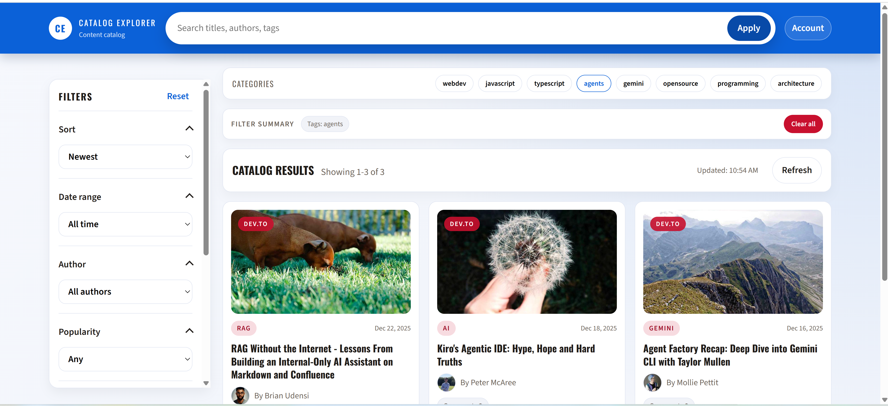

# Catalog Explorer React App

> A modern content catalog dashboard with search, filters, pagination, and resilient data handling for real-world APIs.

[](https://reactjs.org/)
[](LICENSE)

Business-grade content catalog UI built with **React** and **React Query** for data-driven browsing. Designed for demo and portfolio use. 

## Screenshots


*Search and filter interface*


*Content catalog grid view*


*Pagination controls*

## Features

- **Catalog Layout**: Sticky top bar, left filter sidebar, and category pills
- **Advanced Filtering**: Search, author filter, tag multi-select, date range, minimum comments
- **Sorting & Pagination**: Flexible sorting controls with paginated results
- **URL-Driven State**: Shareable/bookmarkable links with back/forward navigation
- **React Query Integration**: Caching, retries, background refetching, and stale-while-revalidate
- **Resilient UX**: Skeleton loading, empty/error states, and filter summary with "Clear all"
- **Schema Validation**: Runtime validation with telemetry hooks
- **Accessibility**: Keyboard navigation and focus management

## Tech Stack

- **React** - Function components with hooks
- **React Query** - Data fetching, caching, and synchronization
- **Ajv** - JSON Schema validation
- **Jest & React Testing Library** - Testing suite

## Prerequisites

- Node.js 14+ 
- npm or yarn

## Installation

1. Clone the repository: 
   ```bash
   git clone https://github.com/oyebiyisunday/react-content-catalog-dashboard.git
   cd react-content-catalog-dashboard
   ```

2. Install dependencies:
   ```bash
   npm install
   ```

3. (Optional) Configure custom API: 
   ```bash
   cp .env.example .env.local
   # Edit .env.local to set REACT_APP_ARTICLES_URL
   ```

4. Start the development server:
   ```bash
   npm start
   ```

5. Open your browser to [http://localhost:3000](http://localhost:3000)

## Configuration

### Data Source

By default, the app fetches from the [Dev.to API](https://dev.to/api/articles):
```
https://dev.to/api/articles?per_page=30
```

To use a custom API, create `.env.local`:

```bash
REACT_APP_ARTICLES_URL=https://your-api.com/articles
```

When configured, a "Configured API" option appears in the Data Source switcher. 

### Multi-Type Payloads

For APIs returning mixed schemas, format items as: 

```json
{
  "type": "article",
  "data": { ...  }
}
```

Supported types: `article`, `devto`. Unknown types are ignored and reported via telemetry.

## Project Structure

```text
src/
├── components/    # UI components (layout, filters, cards, pagination, skeletons)
├── hooks/         # Custom hooks (data fetching, URL state management)
├── utils/         # Utilities (normalization, sorting, telemetry, validation)
└── schemas/       # JSON schemas for data validation
```

## Schema & Validation

The article contract is defined in `src/schemas/articles.schema.json`.

Runtime validation occurs after normalization. Invalid items are dropped and reported via `src/utils/telemetry.js`.

To integrate monitoring, provide: 

```javascript
window.__APP_MONITOR__.reportEvent(name, payload)
```

## Testing

The test suite covers:
- Normalization and sorting logic
- Schema validation
- UI rendering states (loading, empty, error)

Run tests: 

```bash
npm test
```

Run with coverage:

```bash
npm test -- --coverage
```

## Development Highlights

Built to demonstrate: 

- ✅ Scalable, data-driven catalog UI with complex state management
- ✅ URL-driven state for shareable/bookmarkable links
- ✅ Fault-tolerant API consumption with caching and retries
- ✅ Advanced search, filter, and sort capabilities
- ✅ Resilient UX with proper loading and error states
- ✅ Schema validation and telemetry for production readiness

## Browser Support

- Chrome (latest)
- Firefox (latest)
- Safari (latest)
- Edge (latest)

## Contributing

Contributions are welcome! Please feel free to submit a Pull Request.

1. Fork the repository
2. Create your feature branch (`git checkout -b feature/AmazingFeature`)
3. Commit your changes (`git commit -m 'Add some AmazingFeature'`)
4. Push to the branch (`git push origin feature/AmazingFeature`)
5. Open a Pull Request

## License

This project is licensed under the MIT License - see the [LICENSE](LICENSE) file for details.

## Author

**Sunday Oyebiyi**

- GitHub: [@oyebiyisunday](https://github.com/oyebiyisunday)

## Acknowledgments

- Data provided by [Dev.to API](https://developers.forem.com/api)
- Built with [React](https://reactjs.org/) and [React Query](https://tanstack.com/query)

---


